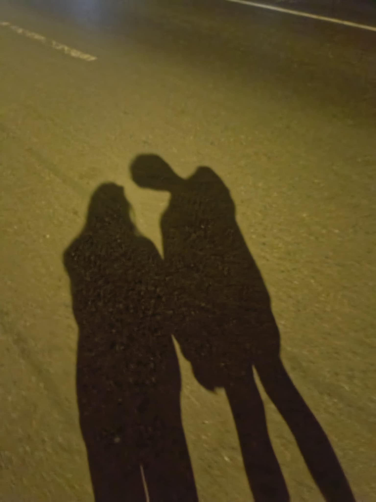

<!doctype html>
<html lang="en" class="h-full">
 <head>
  <meta charset="UTF-8">
  <meta name="viewport" content="width=device-width, initial-scale=1.0">
  <title>Happy Valentine's Love 💕</title>
  
  
  <link href="https://fonts.googleapis.com/css2?family=Cormorant+Garamond:ital,wght@0,400;0,600;1,400;1,600&amp;family=Quicksand:wght@300;400;500;600&amp;display=swap" rel="stylesheet">
  
  
  
 </head>
<body>
  

  
<!-- PAGE 1: PASSWORD ENTRY -->
   <section id="page1" class="page active">
    

     

      
     

     <h1 class="greeting-title" id="greeting-msg">Happy Valentine's love</h1>
     
Enter Our monthsary
<!-- PIN Display -->
     

     

      ❌ Wrong code, try again
     
<!-- Number Pad -->
     

    

   </section><!-- PAGE 2: ROSE & LETTER -->
   <section id="page2" class="page">
     

       
     

    

    

     
Tap to open 💌

     <svg class="envelope" id="envelope-btn" viewbox="0 0 220 150" role="button" tabindex="0" aria-label="Open love letter"><rect x="2" y="2" width="216" height="146" rx="8" fill="#fff" stroke="#f4b8c8" stroke-width="2" /> <polygon points="2,2 110,80 218,2" fill="#fce4ec" stroke="#f4b8c8" stroke-width="1.5" /> <polygon points="2,148 80,90 110,110 140,90 218,148" fill="#fff5f7" stroke="#f4b8c8" stroke-width="1" /> <text x="110" y="105" text-anchor="middle" font-family="Cormorant Garamond,serif" font-size="14" fill="#e8839b" font-style="italic">
       For You
      </text>
     </svg>
    

   </section><!-- LETTER OVERLAY -->
   

    

     

      💌
     

     <h2 class="letter-title" id="letter-title">My Dearest Love</h2>
     

      Every moment with you is precious. You fill my life with joy, love, and warmth. Thank you for being my person, my love, and my everything. Forever yours.
     

     

      Love always, 
      Your future husband ❤
     
<button class="continue-btn" id="continue-btn">Continue →</button>
    

   
<!-- PAGE 3: GALLERY -->
   <section id="page3" class="page">
    

     

      

       

         
       

      

      <h2 class="gallery-title" id="gallery-title">Our Beautiful Memories</h2>
     
<!-- Photo Grid -->
     

      

       

        
       

       
Photo 1

      

      

       

         
       

       
Photo 2

      

      

       

        
       

       
Photo 3

      

      

       

        
       

       
Photo 4

      

     
<!-- Heart Divider -->
     
♡♡♡♡♡
     
<!-- Music Section -->
     

      
🎵 Our Song 🎵

      

       🎶
      

      
Add your favorite song here

     
<!-- Final Message -->
     

      "I'm always here for you" 💕
     
<!-- Decorative Dudus -->
       

         
       

    

   </section>
  

<script>
(function() {
  const PASSWORD = "1221";
  let enteredPin = "";
  let currentPage = 1;

  const defaultConfig = {
    greeting_message: "Happy Valentine's love",
    letter_title: "My Dearest Love",
    letter_message: "Happy Valentine's Day, Love.\n\nHi love, I just want to take this moment to tell you something. Thank you for choosing me and for being patient with me. I know you get tired sometimes because of the things I do and because I can be childish sometimes.\n\nThank you for still staying even during our boring days and for always understanding me. I will do my best to keep and protect this relationship.\nI love you for who you are as a woman. Maybe you didn't completely meet my ideal woman I once imagined, but I'm thankful that I met you and that we became \"us.\" I love everything about you, your looks, your actions, and the way you think. I know we both have insecurities, and I accept yours completely.\n\nJust because you get mad sometimes doesn't mean I'll give up. I understand that in a relationship, disagreements and irritation are normal, especially with our situation. But one day, this distance will be gone, and we'll be together without worrying about time. I'll do everything I can to keep this relationship strong so we can reach that day.\n\nI love you so much.\n\nWhen I first saw you, I was really interested in you. Thank you for those little glances and small things you did that gave me the reason to take a first move for you. January 16, 2025 our first conversation. I courted you for almost a year before we finally became official, and I'm so thankful that you said yes to me.\n\nNong umuwi ako sa probinsya and I saw you, I was happy. I was so excited to hug you, but I still nervous. The gift I was supposed to give you the next day for your birthday, ay nabigay ko nalang dahil sa excitement nong makita ka. That day was so special, especially our night walks and of course, our first kiss, something ang sarap alalahanin ng mga bagay na yon.\n\nMaybe both of us didn't completely meet each other's standards for a partner. I know I'm not a perfect boyfriend for you. I don't always do the things you want or your interests. But I will give everything I have to understand you and choose you every single day, just to keep what we have.\n\nThere's no certainty about what the future holds, but I will support your dreams. I'll stay right here beside you, even on heavy days. I will continue to understand you for as long as I can.\n\nI love you sooo muchhh, and I miss youuu.\n\nI'm always by your side. ❤️",
    letter_signature: "Love always,\nYour future husband ❤️",
    gallery_title: "Our Beautiful Memories"
  };

  // Create floating hearts background
  function createFloatingHearts() {
    const container = document.getElementById('floating-hearts');
    const hearts = ['♡', '❤', '💕', '♥'];
    for (let i = 0; i < 15; i++) {
      const heart = document.createElement('span');
      heart.className = 'floating-heart';
      heart.textContent = hearts[Math.floor(Math.random() * hearts.length)];
      heart.style.left = Math.random() * 100 + '%';
      heart.style.top = (60 + Math.random() * 40) + '%';
      heart.style.animationDuration = (6 + Math.random() * 8) + 's';
      heart.style.animationDelay = Math.random() * 10 + 's';
      heart.style.fontSize = (12 + Math.random() * 14) + 'px';
      container.appendChild(heart);
    }
  }
  createFloatingHearts();

  // Initialize PIN pad
  function initPinPad() {
    const pad = document.getElementById('number-pad');
    const display = document.getElementById('pin-display');

    // Create display dots
    for (let i = 0; i < 4; i++) {
      const dot = document.createElement('div');
      dot.className = 'pin-dot';
      display.appendChild(dot);
    }

    // Create number buttons
    for (let i = 1; i <= 9; i++) {
      const btn = document.createElement('button');
      btn.className = 'pin-btn';
      btn.textContent = i;
      btn.addEventListener('click', () => enterPin(i.toString()));
      pad.appendChild(btn);
    }

    // Empty cell
    pad.appendChild(document.createElement('div'));

    // 0 button
    const btn0 = document.createElement('button');
    btn0.className = 'pin-btn';
    btn0.textContent = '0';
    btn0.addEventListener('click', () => enterPin('0'));
    pad.appendChild(btn0);

    // Delete button
    const delBtn = document.createElement('button');
    delBtn.className = 'pin-btn';
    delBtn.textContent = '⌫';
    delBtn.addEventListener('click', deletePin);
    pad.appendChild(delBtn);
  }

  function enterPin(num) {
    if (enteredPin.length < 4) {
      enteredPin += num;
      updatePinDisplay();
      if (enteredPin.length === 4) {
        setTimeout(checkPin, 300);
      }
    }
  }

  function deletePin() {
    enteredPin = enteredPin.slice(0, -1);
    updatePinDisplay();
    document.getElementById('pin-error').classList.remove('show');
  }

  function updatePinDisplay() {
    const dots = document.qu
// Rose animation
  function startRoseAnimation() {
    const scene = document.getElementById('rose-scene');
    scene.innerHTML = '';

    // Stem
    const stem = document.createElement('div');
    stem.className = 'rose-stem';
    scene.appendChild(stem);

    // Leaves
    setTimeout(() => {
      const leaf1 = document.createElement('div');
      leaf1.className = 'rose-leaf';
      leaf1.style.cssText = 'bottom:50px; left:calc(50% + 2px); --leaf-rot:-30deg;';
      scene.appendChild(leaf1);

      const leaf2 = document.createElement('div');
      leaf2.className = 'rose-leaf';
      leaf2.style.cssText = 'bottom:90px; right:calc(50% + 2px); --leaf-rot:210deg; transform-origin:right center;';
      leaf2.style.animationDelay = '0.2s';
      scene.appendChild(leaf2);
    }, 1000);

    // Petals
    const petalColors = ['#e8839b', '#f4b8c8', '#e88da3', '#f0a0b5', '#d9708a', '#f5c2d0', '#e6778f', '#eea5b8'];
    const petalData = [
      { rot: '0deg', x: 0, y: -14, w: 28, h: 32 },
      { rot: '45deg', x: 12, y: -8, w: 26, h: 30 },
      { rot: '90deg', x: 16, y: 4, w: 24, h: 28 },
      { rot: '135deg', x: 10, y: 14, w: 26, h: 30 },
      { rot: '180deg', x: -2, y: 16, w: 28, h: 32 },
      { rot: '225deg', x: -14, y: 10, w: 26, h: 30 },
      { rot: '270deg', x: -18, y: -2, w: 24, h: 28 },
      { rot: '315deg', x: -12, y: -12, w: 26, h: 30 }
    ];

    setTimeout(() => {
      const centerX = 100;
      const centerY = 80;
      petalData.forEach((p, i) => {
        const petal = document.createElement('div');
        petal.className = 'rose-petal';
        petal.style.left = (centerX + p.x - p.w / 2) + 'px';
        petal.style.top = (centerY + p.y - p.h / 2) + 'px';
        petal.style.width = p.w + 'px';
        petal.style.height = p.h + 'px';
        petal.style.background = petalColors[i];
        petal.style.setProperty('--rot', p.rot);
        petal.style.animationDelay = (1.6 + i * 0.12) + 's';
        scene.appendChild(petal);
      });

      // Rose center
      setTimeout(() => {
        const center = document.createElement('div');
        center.style.cssText = `
          position:absolute; left:${centerX - 10}px; top:${centerY - 6}px;
          width:20px; height:20px; border-radius:50%;
          background:radial-gradient(circle, #d9607a, #c44d6a);
          opacity:0; transition: opacity 0.5s ease;
        `;
        scene.appendChild(center);
        setTimeout(() => { center.style.opacity = '1'; }, 100);
      }, 2800);
    }, 1500);

    // Show envelope after rose blooms
    setTimeout(() => {
      const envelope = document.getElementById('envelope-wrapper');
      envelope.classList.add('show');
    }, 3600);
  }

  // Envelope interaction
  const envelopeBtn = document.getElementById('envelope-btn');
  envelopeBtn.addEventListener('click', () => {
    document.getElementById('letter-overlay').classList.add('open');
  });
  envelopeBtn.addEventListener('keydown', (e) => {
    if (e.key === 'Enter' || e.key === ' ') {
      e.preventDefault();
      document.getElementById('letter-overlay').classList.add('open');
    }
  });

  // Close letter overlay
  document.getElementById('letter-overlay').addEventListener('click', (e) => {
    if (e.target === e.currentTarget) {
      document.getElementById('letter-overlay').classList.remove('open');
    }
  });

  // Continue button
  document.getElementById('continue-btn').addEventListener('click', () => {
    document.getElementById('letter-overlay').classList.remove('open');
    setTimeout(() => goToPage(3), 400);
  });

  // Apply configuration
  function applyConfig(config) {
    const cfg = config || defaultConfig;

    document.getElementById('greeting-msg').textContent = cfg.greeting_message || defaultConfig.greeting_message;
    document.getElementById('letter-title').textContent = cfg.letter_title || defaultConfig.letter_title;
    document.getElementById('letter-body').textContent = cfg.letter_message || defaultConfig.letter_message;
    document.getElementById('letter-signature').innerHTML = (cfg.letter_signature || defaultConfig.letter_signature).replace(/\n/g, ' ');
    document.getElementById('gallery-title').textContent = cfg.gallery_title || defaultConfig.gallery_title;
  }

  // Element SDK
  if (window.elementSdk) {
    window.elementSdk.init({
      defaultConfig: defaultConfig,
      onConfigChange: async (config) => {
        applyConfig(config);
      },
      mapToCapabilities: (config) => ({
        recolorables: [],
        borderables: [],
        fontEditable: undefined,
        fontSizeable: undefined
      }),
      mapToEditPanelValues: (config) => new Map([
        ["greeting_message", config.greeting_message || defaultConfig.greeting_message],
        ["letter_title", config.letter_title || defaultConfig.letter_title],
        ["letter_message", config.letter_message || defaultConfig.letter_message],
        ["letter_signature", config.letter_signature || defaultConfig.letter_signature],
        [